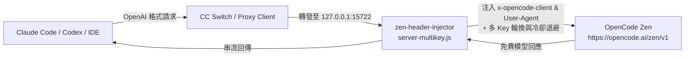

# 🍜 客家 AICODE (HakkaAICODE)

<div align="center">

> **「省下每一分算力，用好每一份免費額度。」**  
> 一個為開發者打造的 AI Coding 免費/低成本後端啟動套件。

[](LICENSE)
[](#)
[](#)
[](#)

</div>

---

## 📖 專案簡介

**客家 AICODE** 的核心目標非常純粹：**幫助新手與開發者用最簡單的方式，將 Claude Code、Codex、Cursor、Cline 等 AI 寫程式工具對接到免費的大型語言模型後端。**

只需複製一段預先寫好的提示詞（Prompt），貼給你的 AI Agent，它就會自動幫你把轉發代理、標頭注入器與 [CC Switch](https://github.com/farion1231/cc-switch) 一鍵配置完成，無痛開始寫程式！

---

## 🌟 核心特色

- ⚡ **一鍵自動化配置**：提供專屬提示詞，讓 Claude Code 或 Codex 自己搞定環境配置。
- 🔄 **多 KEY 自動輪換**：遭遇 `429 Too Many Requests` 或 `401` 自動切換至備用金鑰，並支援指數退避冷卻。
- 🔥 **金鑰動態熱重載 (Hot-Reload)**：修改 `zen-keys.txt` 存檔立即生效，完全不用重啟代理伺服器。
- 🩺 **即時健康檢測**：內建 `/__health` 與 `/v1/status` 端點，金鑰去識別化遮蔽，安全無虞。
- 🔍 **零依賴模型檢查工具**：內建 `scripts/check-models.js`，一秒查詢當前最新可用之免費模型（`-free`）。
- 💻 **跨平台支援**：支援 Windows (PowerShell) 與 macOS / Linux / WSL (Bash)。
- 🛡️ **安全第一**：金鑰只存在本機，預設排除於 Git 版本控制之外，絕不上傳公開倉庫。

---

## 🚀 快速開始（一鍵提示詞）

請將以下整段提示詞複製，貼到 **Claude Code** 或 **Codex** 的對話視窗中：

```text
請依照 https://github.com/xup61069/HakkaAICODE 的指引，把我這台電腦的 AI coding 環境設定成 OpenCode Zen 免費後端。

OPEN_CODE_ZEN_KEY=你的 OPENCODE ZEN KEY
OPEN_CODE_ZEN_KEYS=可選，多 KEY 自動輪換用；有多把 key 就一行一把貼在這裡，沒有就留空

請自動完成以下項目：
1. 如果 OPEN_CODE_ZEN_KEY 仍為空，請先開啟 https://opencode.ai/auth 引導我登入並複製 API 金鑰。
2. 檢查本機是否安裝 CC Switch，若無則下載並安裝最新版本。
3. 取得並啟動 zen-header-injector（https://github.com/xup61069/zen-header-injector），改用多 KEY 版 scripts/server-multikey.js 啟動，確認 http://127.0.0.1:15722/v1 正常響應。
4. 如果提供了 OPEN_CODE_ZEN_KEYS，將金鑰寫入 %USERPROFILE%\HakkaAICODE\zen-keys.txt（不要 commit、不要外流），injector 遇 429/401 會自動輪換下一把。
5. 依照我目前使用的 agent（Claude Code 或 Codex）設定 Provider：
   - Base URL: http://127.0.0.1:15722/v1
   - 預設模型: deepseek-v4-flash-free 或 mimo-v2.5-free（挑選目前可用的 -free 模型）
6. 不要把我提供的金鑰寫進 repo、log 或任何公開檔案。
7. 完成後列出：CC Switch 安裝位置、injector 運行狀態、設定檔改了哪裡、zen-keys.txt 裡有幾把 key。
```

> 💡 更多供應商提示詞（OpenRouter、GitHub Models、Google Gemini 等）請參考 [prompts/](prompts/) 目錄。

---

## 🏗️ 運作架構



### 為什麼需要 zen-header-injector？
- **CC Switch** 負責管理與切換不同 AI Provider。
- **zen-header-injector** 在轉送請求時補上 OpenCode Zen 免費方案所必須的兩個特定標頭：
  - `x-opencode-client: terminal`
  - `User-Agent: opencode`
- 缺少這兩個標頭會導致 Codex 出現 `429 FreeUsageLimitError`。

---

## 🛠️ 手動安裝與管理

### 1. 前置需求
- **Node.js 16+**（[官網下載](https://nodejs.org/) 或 Windows 執行 `winget install OpenJS.NodeJS.LTS --silent`）
- **Git**

### 2. 啟動多 KEY 輪換代理

**Windows (PowerShell):**
```powershell
powershell -ExecutionPolicy Bypass -File .\scripts\setup-multikey.ps1
```

**macOS / Linux / WSL (Bash):**
```bash
chmod +x ./scripts/setup-multikey.sh
./scripts/setup-multikey.sh
```

### 3. 設定金鑰 (zen-keys.txt)
將你的 API Key 貼入使用者目錄底下的 `zen-keys.txt`（每行一把，支援 `#` 註解）：
- Windows: `%USERPROFILE%\HakkaAICODE\zen-keys.txt`
- macOS/Linux: `~/HakkaAICODE/zen-keys.txt`

```text
# 每行一把 OpenCode Zen 金鑰
sk-zen-abcdef123456...
sk-zen-789xyz456123...
```
> 🔔 **熱重載特性**：儲存檔案後，運作中的代理伺服器會自動載入最新金鑰，不需重啟！

### 4. 查詢可用免費模型
執行專案內建的檢測工具：
```bash
node scripts/check-models.js
```
輸出範例：
```text
📦 資料來源: 本地代理 (http://127.0.0.1:15722/v1/models)
✨ 發現免費模型 (-free): 6 個

--------------------------------------------------------
 🆓 免費模型推薦清單
--------------------------------------------------------
  1. deepseek-v4-flash-free         (擁有者: opencode)
  2. mimo-v2.5-free                 (擁有者: opencode)
  3. nemotron-3.5-lightning-free    (擁有者: opencode)
  4. hy3-free                       (擁有者: opencode)
  5. nemotron-3-ultra-free          (擁有者: opencode)
  6. laguna-s-2.1-free              (擁有者: opencode)
```

### 5. 檢測代理健康狀態
在瀏覽器或終端機存取 `http://127.0.0.1:15722/__health`：
```bash
curl http://127.0.0.1:15722/__health
```

---

## 🌐 2026 免費與平價 AI 路線矩陣

除了 OpenCode Zen，我們也整理了其他主流合法免費/低門檻方案：

| 平台 | 適用情境 | 推薦模型 | 提示詞與指南 |
| :--- | :--- | :--- | :--- |
| **OpenCode Zen** | 日常主力 Coding | `deepseek-v4-flash-free`<br>`mimo-v2.5-free` | [Prompts](prompts/setup-opencode-zen.md) / [Docs](docs/opencode-zen.md) |
| **OpenRouter Free** | 多樣化開源模型 | `deepseek/deepseek-chat:free`<br>`meta-llama/llama-3.3-70b-instruct:free` | [Prompts](prompts/setup-openrouter-free.md) |
| **Google AI Studio** | 超大上下文 / 專案重構 | `gemini-2.5-flash`<br>`gemini-2.5-flash-lite` | [Prompts](prompts/setup-gemini-free.md) |
| **GitHub Models** | 旗艦商用模型體驗 | `gpt-4o`<br>`gpt-4o-mini` | [Prompts](prompts/setup-github-models.md) |

完整分析請參閱 📄 [2026 免費與平價 AI Coding 指南](docs/free-ai-tiers.md)。

---

## ❓ 常見問題 (FAQ)

<details>
<summary><b>Q1: 為什麼執行時出現 429？換了 Key 還是一樣？</b></summary>
OpenCode Zen 的免費額度是社群共用池。如果整個時段官方免費配額皆已滿載，多 KEY 輪換亦無法突破上游極限。建議稍後重試，或切換至 OpenRouter Free 或 Google AI Studio 免費層。
</details>

<details>
<summary><b>Q2: 端口 15722 被佔用 (EADDRINUSE) 怎麼辦？</b></summary>
重新執行 <code>setup-multikey.ps1</code>（或 <code>setup-multikey.sh</code>），腳本會自動終止舊進程並重新啟動。你也可以設定環境變數自訂端口：<br>
<code>$env:ZEN_INJECTOR_PORT=15723; node scripts/server-multikey.js</code>
</details>

<details>
<summary><b>Q3: Key 會不會有洩漏風險？</b></summary>
本專案為 100% 本地運行的開源代理，服務只監聽本機 <code>127.0.0.1</code>，絕不對外開放網段。金鑰檔 <code>zen-keys.txt</code> 已列入 <code>.gitignore</code>，健康檢查端點也會自動將金鑰進行遮蔽處理。
</details>

---

## 🤝 貢獻與反饋

歡迎提交 Issue 與 Pull Request！若有新發現的優質免費後端或改進建議，歡迎交流分享。

## 📜 授權條款

本專案基於 [MIT License](LICENSE) 開源。
