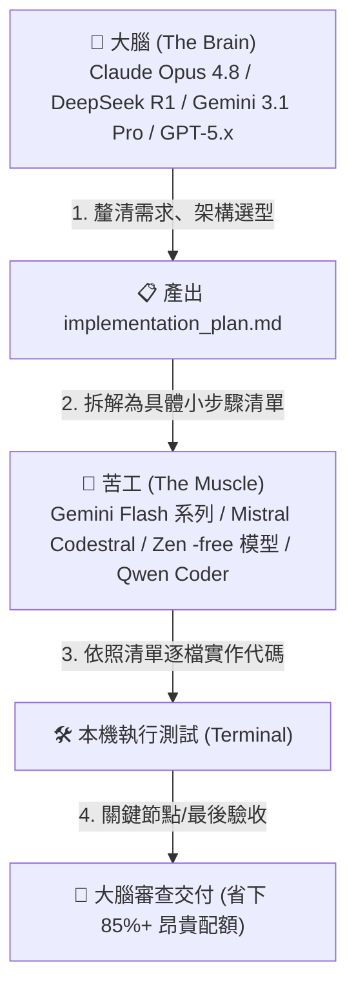
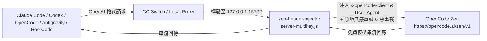

# 🍜 客家 AICODE (HakkaAICODE)

<div align="center">

> **「省下每一分算力，用好每一份免費額度。」**  
> 一個專為開發者打造的 **AI / Vibe Coding 免費神器推薦、極限省額度攻略與後端啟動套件**。

[](LICENSE)
[](https://github.com/xup61069/HakkaAICODE/actions)
[](#)
[](#)
[](#)

</div>

---

## 🌟 🔥 2026 頂級免費與平價 Vibe Coding 神器推薦

想要體驗最流暢的 **Vibe Coding**（自然語言定義意圖與架構，AI 自主搬磚實作代碼）？以下是社群評價最高、支援免費/低成本方案的開發工具：

| 工具名稱 | 工具類型 | 推薦指數 | 核心特色與免費搭配方案 |
| :--- | :--- | :---: | :--- |
| **🚀 Google Antigravity (AGY)** | 頂級 Agentic IDE / CLI | ⭐⭐⭐⭐⭐ | **Google DeepMind 打造的次世代 Agent 環境**！內建 Planning Mode 架構規劃、Subagents 多代理分工、Artifacts 成果畫布與完整終端操作權限。可直接串接 Gemini 3.1 / 2.5 免費層或自訂 OpenAI 端點。 |
| **🤖 Roo Code (前 Roo Cline) / Cline** | VS Code 開源外掛 | ⭐⭐⭐⭐⭐ | **100% 開源無拘束**！完全自主掌控 Provider，可直接填入本專案代理端點 (`http://127.0.0.1:15722/v1`)、Mistral Codestral 或 OpenRouter 免費模型，支援自訂 MCP 工具與模式切換。 |
| **🧠 OpenManus / Manus** | 自主通用 Agent | ⭐⭐⭐⭐⭐ | **熱門通用自主代理**！具備多步任務規劃、瀏覽器自動化（Browser-Use）、代碼撰寫與終端執行能力。可使用開源版 [OpenManus](prompts/setup-openmanus.md) 直接對接 HakkaAICODE 免費代理或 Gemini 免費層。 |
| **🔄 CC Switch** | Provider 切換管理工具 | ⭐⭐⭐⭐⭐ | **本專案的核心樞紐**！一份設定檔同步到 Claude Code / Codex / OpenCode / OpenClaw / Gemini CLI / Hermes Agent，系統匣一鍵切換 provider。用 [一鍵提示詞](prompts/setup-cc-switch.md) 把所有免費後端一次配好。 |
| **⚡ Cursor** | AI 原生 IDE | ⭐⭐⭐⭐⭐ | 業界指標級 AI IDE，擁有無敵流暢的 Tab 智慧補全與 Composer 多檔案聯動編輯，提供 Free / Hobby 免費體驗。 |
| **🌊 Windsurf (Cognition)** | AI 原生 IDE | ⭐⭐⭐⭐⭐ | 搭載 Cascade 流程感知對話引擎，對整個 Codebase 理解極深，免費版提供充裕的智慧代碼補全與對話配額。 |
| **⌨️ Claude Code / Codex** | 終端原生 Agent | ⭐⭐⭐⭐ | 終端命令列最愛！純終端運作、原生 Git/Shell 深度整合，搭配本專案的一鍵 Prompt 立即起飛。 |
| **🔎 Perplexity Sonar API** | 聯網搜尋 API | ⭐⭐⭐⭐ | **研究/查文件專用**！即時搜尋 + 引用來源，補上 coding agent 知識 cutoff 的即時性缺口。按量計費，見 [配置提示詞](prompts/setup-perplexity.md)。 |
| **🌐 Continue.dev / Void Editor** | 開源 VS Code 插件 / IDE | ⭐⭐⭐⭐ | 隱私優先、完全開源透明，支援在 本機 Ollama / HakkaAICODE 代理 / 雲端 API 之間無縫任意切換。 |
| **⚡ v0 / Bolt.new / Lovable** | Web 快速原型 | ⭐⭐⭐⭐ | 自然語言一鍵生成 Fullstack 網頁與 React 元件，適合靈感驗證與快速前端出圖。 |

---

## 🧠 💡 客家頂級省額度心法 (Vibe Coding 算力利用率最大化)

> **「不要拿重砲打蚊子，也不要讓小兵做大架構決策。」**  
> 懂得調配大腦與苦工模型，你的免費額度能多寫 10 倍代碼！



### 1. 🎯 「大腦規劃，苦工打底」模型分工術 (Tiered Brain & Muscle)
- **第一步：大腦規劃（The Brain）**
  - **選用模型**：當代旗艦，如 `Claude Opus 4.8`、`DeepSeek R1`、`Gemini 3.1 Pro`、`GPT-5.x`（以當下最新為準）。
  - **任務**：深度理解需求、分析技術架構、產出任務清單與 `implementation_plan.md`。
  - **重點**：**只讓大腦做決策與寫架構規格，不要讓大腦逐行輸出幾千行代碼**。
- **第二步：苦工實作（The Muscle）**
  - **選用模型**：速度快、配額高或免費的模型，如最新 `Gemini Flash`、`Mistral Codestral`、`deepseek-v4-flash-free`（或以 `node scripts/check-models.js` 查到的當下 `-free` 模型）。
  - **任務**：拿著大腦規劃好的 Step 1~Step 5 清單，**讓它慢慢寫、逐檔填寫實現代碼**。
- **第三步：大腦驗收（The Critic）**
  - 遇到複雜卡關或全部寫完時，再切回大腦模型做一次性 Code Review 與邊界檢查。
- 💸 **省額度效果**：品質等同全旗艦大模型，但節省高達 **80% ~ 90%** 的珍貴額度！

### 2. 🧹 「Context 瘦身術」避免 Token 滾雪球
- AI 每輪對話都會重複發送全部歷史與開啟的檔案。對話到第 15 輪，每次隨便問一句話就要消耗數萬 Tokens！
- **客家作法**：每完成一個獨立功能或修好一個 Bug，立刻 `/clear` 或開新對話（New Session），讓 AI 在乾淨輕量的狀態繼續下個任務。
- **排除雜訊**：設定好 `.gitignore` 或 `.cursorrules`，排除 `node_modules/`、`dist/`、`package-lock.json` 與巨大的 `*.log`。

### 3. ✂️ 「增量 Diff 補丁」拒絕全檔覆寫
- 修改 500 行檔案中的 2 行，全檔重寫會浪費 500 Output Tokens 且生成極慢。
- 要求 AI：「**僅輸出 Unified Diff 或 Search/Replace Block**」，速度提升 5 倍且省下大量輸出 Token。

### 4. 🔄 「多 Key 輪換 + 多級備援防線」
- **第一防線**：Mistral Codestral 免費層（30 RPM 專用 Coding API）與 OpenCode Zen（搭配本專案 `server-multikey.js` 支援原地無感重試）。
- **第二防線**：OpenRouter `:free` 系列（儲值 $10 升級 1,000 req/day 配額）與 NVIDIA NIM（~40 RPM 免費推論）。
- **第三防線**：Google AI Studio Gemini 免費層（超大上下文，專治大專案重構）。
- **第四防線（超低價 Overflow）**：DeepSeek V3/V4 直連或智譜 GLM Coding Plan。
- **研究/查資料線（並行）**：Perplexity Sonar API（即時聯網搜尋 + 引用來源，按量計費）。

> 📖 更多進階省額度技巧請閱讀 📄 [客家 Vibe Coding 終極指南](docs/vibe-coding-guide.md)。

---

## 🚀 快速開始（一鍵配置提示詞）

將以下整段提示詞複製，貼到 **Claude Code**、**Codex**、**Google Antigravity** 或 **Roo Code** 對話框：

```text
請依照 https://github.com/xup61069/HakkaAICODE 的指引，把我這台電腦的 AI coding 環境設定成 OpenCode Zen 免費後端。

OPEN_CODE_ZEN_KEY=你的 OPENCODE ZEN KEY (可透過 opencode auth login 或在 opencode.ai 取得)
OPEN_CODE_ZEN_KEYS=可選，多 KEY 自動輪換用；有多把 key 就一行一把貼在這裡，沒有就留空

請自動完成以下項目：
1. 如果 OPEN_CODE_ZEN_KEY 仍為空，請引導我登入並取得 API 金鑰。
2. 檢查本機是否安裝 CC Switch，若無則下載並安裝最新版本。
3. 取得並啟動 zen-header-injector（https://github.com/xup61069/zen-header-injector），改用多 KEY 原地重試版 scripts/server-multikey.js 啟動，確認 http://127.0.0.1:15722/v1 正常響應。
4. 如果提供了 OPEN_CODE_ZEN_KEYS，將金鑰寫入 %USERPROFILE%\HakkaAICODE\zen-keys.txt（不要 commit、不要外流），injector 遇 429/401 會自動在 Proxy 內原地無感重試下一把。
5. 依照我目前使用的 agent（Claude Code / Codex / Roo Code / OpenCode / Gemini CLI）設定 Provider：
   - Base URL: http://127.0.0.1:15722/v1
   - 預設模型: 執行 node scripts/check-models.js 挑選目前可用的 -free 模型
6. 不要把我提供的金鑰寫進 repo、log 或任何公開檔案。
7. 完成後列出：CC Switch 安裝位置、injector 運行狀態、設定檔改了哪裡、zen-keys.txt 裡有幾把 key。
```

> 💡 更多後端與 Agent 提示詞請參閱 [prompts/](prompts/) 目錄（[CC Switch 一鍵全配置](prompts/setup-cc-switch.md) / [OpenManus](prompts/setup-openmanus.md) / [Mistral Codestral](prompts/setup-mistral-codestral.md) / [OpenRouter](prompts/setup-openrouter-free.md) / [Google Gemini](prompts/setup-gemini-free.md) / [NVIDIA NIM](prompts/setup-nvidia-nim.md) / [Perplexity Sonar](prompts/setup-perplexity.md) / [GLM Coding Plan](prompts/setup-glm-coding-plan.md) / [GitHub Models (已退役)](prompts/setup-github-models.md)）。

---

## 🏗️ 運作架構



### 為什麼需要 zen-header-injector？
- **CC Switch** 負責管理與快速切換不同 AI Provider（2026 年版支援 Claude Code、Codex、OpenCode、OpenClaw、Gemini CLI、Hermes Agent）。
- **zen-header-injector** 負責在轉送請求時補齊 OpenCode Zen 免費方案所要求的兩個特定標頭：
  - `x-opencode-client: terminal`
  - `User-Agent: opencode`
- 缺少標頭會導致使用免費模型時出現 `429 FreeUsageLimitError`。

> ⚠️ **服務條款說明**：注入終端標頭係轉發官方 CLI 標頭以獲取終端免費額度，此機制受上游政策約束，請使用者自行評估使用風險。

---

## 🛠️ 本機管理與實用指令

### 1. 啟動多 KEY 輪換代理

**Windows (PowerShell):**
```powershell
powershell -ExecutionPolicy Bypass -File .\scripts\setup-multikey.ps1
```

**macOS / Linux / WSL (Bash):**
```bash
chmod +x ./scripts/setup-multikey.sh
./scripts/setup-multikey.sh
```

### 2. 設定金鑰 (zen-keys.txt)
將你的 API Key 貼入使用者目錄底下的 `zen-keys.txt`（每行一把，支援 `#` 註解）：
- Windows: `%USERPROFILE%\HakkaAICODE\zen-keys.txt`
- macOS/Linux: `~/HakkaAICODE/zen-keys.txt`

```text
# 每行一把 OpenCode Zen 金鑰
sk-zen-abcdef123456...
sk-zen-789xyz456123...
```
> 🔔 **熱重載特性**：儲存檔案後，運作中的代理伺服器會自動載入最新金鑰，**不需手動重啟**！

### 3. 一鍵查詢可用免費模型
免費模型名單以官方即時 API 為準，請執行專案內建工具查詢：
```bash
node scripts/check-models.js
```

### 4. 檢測代理健康與金鑰狀態
在瀏覽器或終端機存取 `http://127.0.0.1:15722/__health`：
```bash
curl http://127.0.0.1:15722/__health
```

### 5. 自動化測試 (Automated Testing)
本專案內建完整的零依賴代理測試套件，包含標頭注入、429 原地重試、401 失效標記、熱重載與健康端點檢查：
```bash
npm test
# 或直接執行: node test/test-proxy.js
```

---

## ❓ 常見問題 (FAQ)

<details>
<summary><b>Q1: 遭遇 429 時多 KEY 輪換如何運作？若整個免費池用盡怎麼辦？</b></summary>
當特定金鑰觸發 429 速率限制時，升級後的 <code>server-multikey.js</code> 會在 Proxy 內部緩存請求並<b>原地使用下一把可用 Key 重試（In-Place Retry）</b>，當前對話不會中斷報錯。但若上游整體的共用免費池均已飽和，輪換亦無法突破上游總量限制，建議切換至 Codestral、OpenRouter 或 Google Gemini 免費層。
</details>

<details>
<summary><b>Q2: 端口 15722 被佔用 (EADDRINUSE) 怎麼辦？</b></summary>
重新執行 <code>setup-multikey.ps1</code>（或 <code>setup-multikey.sh</code>），腳本會自動檢查並終止舊 Node 進程後重新啟動。你也可以設定環境變數自訂端口：<br>
<code>$env:ZEN_INJECTOR_PORT=15723; node scripts/server-multikey.js</code>
</details>

<details>
<summary><b>Q3: 金鑰安全性與隱私問題？</b></summary>
本專案為 100% 本地運行的開源代理，服務只監聽本機 <code>127.0.0.1</code>。金鑰檔 <code>zen-keys.txt</code> 已列入 <code>.gitignore</code>，健康檢查端點也會自動遮蔽金鑰。<br>
<strong>CORS 預設關閉</strong>：跨來源存取需明確設定 <code>ZEN_INJECTOR_CORS=1</code> 才開啟——因為代理會自動注入金鑰，對所有網頁開放 CORS 等於把額度暴露給任何你開著的網站。<br>
另外請注意，公共免費模型通常保留資料訓練權利，請勿傳輸高度敏感代碼。
</details>

---

## 🤝 貢獻與反饋

歡迎提交 Issue 與 Pull Request！若有新發現的優質免費後端、Vibe Coding 神器或省額度妙招，歡迎交流分享。

## 📜 授權條款

本專案基於 [MIT License](LICENSE) 開源。
