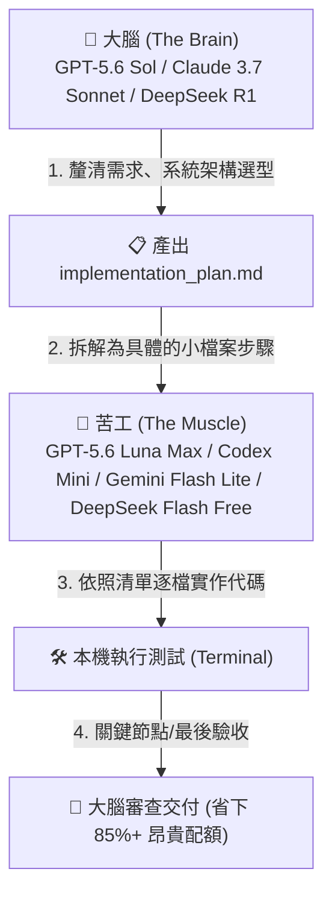

# 🍜 客家 AICODE (HakkaAICODE)

<div align="center">

> **「省下每一分算力，用好每一份免費額度。」**  
> 一個專為開發者打造的 **AI / Vibe Coding 免費神器推薦、極限省額度指南與後端啟動套件**。

[](LICENSE)
[](#)
[](#)
[](#)

</div>

---

## 🌟 🔥 2026 頂級免費 Vibe Coding 神器推薦

想要體驗最流暢的 **Vibe Coding**（自然語言定義架構，AI 自主搬磚寫代碼）？以下是社群評價最高、支援免費/平價方案的開發神器：

| 工具名稱 | 工具類型 | 推薦指數 | 核心特色與客家白嫖玩法 |
| :--- | :--- | :---: | :--- |
| **🚀 Google Antigravity (AGY)** | 頂級 Agentic IDE / CLI | ⭐⭐⭐⭐⭐ | **Google DeepMind 打造的次世代 Agent 環境**！內建 Planning Mode 深度架構規劃、Subagents 多代理分工、Artifacts 成果即時畫布與完整終端操作權限。可直接串接 Gemini 3.7 / 2.5 免費層或自訂 OpenAI 端點，寫大專案極度強大！ |
| **🤖 Roo Code (前 Roo Cline) / Cline** | VS Code 開源外掛 | ⭐⭐⭐⭐⭐ | **100% 開源無綁定**！完全自主控制 Provider，可直接填入本專案代理端點 (`http://127.0.0.1:15722/v1`) 或 OpenRouter 免費模型，支援自訂 MCP 工具與模式切換。 |
| **⚡ Cursor** | AI 原生 IDE | ⭐⭐⭐⭐⭐ | 業界指標級 AI IDE，擁有無敵流暢的 Tab 智慧補全與 Composer 多檔案聯動編輯，提供 Free / Hobby 免費體驗。 |
| **🌊 Windsurf (by Codeium)** | AI 原生 IDE | ⭐⭐⭐⭐⭐ | 搭載 Cascade 流程感知對話引擎，對整個 Codebase 理解極深，免費版提供極度充裕的 AI 補全與對話額度。 |
| **⌨️ Claude Code / Codex** | 終端原生 Agent | ⭐⭐⭐⭐ | 終端命令列最愛！純終端運作、原生 Git/Shell 深度整合，搭配本專案的一鍵 Prompt 立即起飛。 |
| **🌐 Continue.dev / Void Editor** | 開源 VS Code 插件 / IDE | ⭐⭐⭐⭐ | 隱私優先、完全開源透明，支援在 本機 Ollama / HakkaAICODE 代理 / 雲端 API 之間無縫任意切換。 |
| **⚡ v0 / Bolt.new / Lovable** | Web 快速原型 | ⭐⭐⭐⭐ | 自然語言一鍵生成 Fullstack 網頁與 React 元件，適合靈感驗證與快速前端出圖。 |

---

## 🧠 💡 客家頂級省額度心法 (Vibe Coding 算力利用率最大化)

> **「不要拿重砲打蚊子，也不要讓小兵做大決策。」**  
> 懂得調配大腦與苦工模型，你的免費額度能多寫 10 倍代碼！



### 1. 🎯 「大腦規劃，苦工打底」模型分工術 (Tiered Brain & Muscle)
- **第一步：大腦規劃（The Brain）**
  - **選用模型**：`GPT-5.6 Sol`、`Claude 3.7 Sonnet (Thinking)`、`Gemini 3.1 Pro`、`DeepSeek R1`。
  - **任務**：深度理解需求、分析技術架構、產出任務清單與 `implementation_plan.md`。
  - **重點**：**只讓大腦做決策與寫虛擬碼，不要讓大腦逐行輸出幾千行代碼**。
- **第二步：苦工實作（The Muscle）**
  - **選用模型**：`GPT-5.6 Luna Max`、`Codex Mini`、`Gemini 2.5 Flash Lite`、`deepseek-v4-flash-free`、`mimo-v2.5-free`。
  - **任務**：拿著大腦規劃好的 Step 1~Step 5 清單，**讓它慢慢寫、逐檔填寫實現代碼**。
- **第三步：大腦驗收（The Critic）**
  - 遇到複雜卡關或全部寫完時，再切回大腦模型做一次性 Code Review 與邊界檢查。
- 💸 **省額度效果**：品質等同全旗艦大模型，但節省高達 **80% ~ 90%** 的珍貴額度！

### 2. 🧹 「Context 瘦身術」避免 Token 滾雪球
- AI 每輪對話都會重複發送全部歷史與開啟的檔案。對話到第 15 輪，每次隨便問一句話就要消耗 50,000+ Tokens！
- **客家作法**：每完成一個獨立功能或修好一個 Bug，立刻 `/clear` 或開新對話（New Session），讓 AI 在乾淨輕量的狀態繼續下個任務。
- **排除雜訊**：設定好 `.gitignore` 或 `.cursorrules`，排除 `node_modules/`、`dist/`、`package-lock.json` 與巨大的 `*.log`。

### 3. ✂️ 「增量 Diff 補丁」拒絕全檔覆寫
- 修改 500 行檔案中的 2 行，全檔重寫會浪費 500 Output Tokens 且生成極慢。
- 要求 AI：「**僅輸出 Unified Diff 或 Search/Replace Block**」，速度提升 5 倍且省下大量輸出 Token。

### 4. 🔄 「多 Key 輪換 + 三級備援防線」
- **第一防線**：OpenCode Zen 免費池（搭配本專案 `server-multikey.js` 多 Key 自動輪換與階梯冷卻）。
- **第二防線**：OpenRouter `:free` 系列（DeepSeek V3/R1 免費池）。
- **第三防線**：Google AI Studio Gemini 免費層（每日 1500 請求，1M+ 超大上下文）。

> 📖 更多進階省額度技巧請閱讀 📄 [客家 Vibe Coding 終極指南](docs/vibe-coding-guide.md)。

---

## 🚀 快速開始（一鍵配置提示詞）

將以下整段提示詞複製，貼到 **Claude Code**、**Codex**、**Google Antigravity** 或 **Roo Code** 對話框：

```text
請依照 https://github.com/xup61069/HakkaAICODE 的指引，把我這台電腦的 AI coding 環境設定成 OpenCode Zen 免費後端。

OPEN_CODE_ZEN_KEY=你的 OPENCODE ZEN KEY
OPEN_CODE_ZEN_KEYS=可選，多 KEY 自動輪換用；有多把 key 就一行一把貼在這裡，沒有就留空

請自動完成以下項目：
1. 如果 OPEN_CODE_ZEN_KEY 仍為空，請先開啟 https://opencode.ai/auth 引導我登入並複製 API 金鑰。
2. 檢查本機是否安裝 CC Switch，若無則下載並安裝最新版本。
3. 取得並啟動 zen-header-injector（https://github.com/xup61069/zen-header-injector），改用多 KEY 版 scripts/server-multikey.js 啟動，確認 http://127.0.0.1:15722/v1 正常響應。
4. 如果提供了 OPEN_CODE_ZEN_KEYS，將金鑰寫入 %USERPROFILE%\HakkaAICODE\zen-keys.txt（不要 commit、不要外流），injector 遇 429/401 會自動輪換下一把。
5. 依照我目前使用的 agent（Claude Code 或 Codex）設定 Provider：
   - Base URL: http://127.0.0.1:15722/v1
   - 預設模型: deepseek-v4-flash-free 或 mimo-v2.5-free（挑選目前可用的 -free 模型）
6. 不要把我提供的金鑰寫進 repo、log 或任何公開檔案。
7. 完成後列出：CC Switch 安裝位置、injector 運行狀態、設定檔改了哪裡、zen-keys.txt 裡有幾把 key。
```

> 💡 更多後端提示詞請參閱 [prompts/](prompts/) 目錄（[OpenRouter](prompts/setup-openrouter-free.md) / [GitHub Models](prompts/setup-github-models.md) / [Google Gemini](prompts/setup-gemini-free.md)）。

---

## 🏗️ 運作架構


### 為什麼需要 zen-header-injector？
- **CC Switch** 負責管理與快速切換不同 AI Provider。
- **zen-header-injector** 負責在轉送請求時補齊 OpenCode Zen 免費方案所要求的兩個特定標頭：
  - `x-opencode-client: terminal`
  - `User-Agent: opencode`
- 缺少標頭會導致 Codex 出現 `429 FreeUsageLimitError`。

---

## 🛠️ 本機管理與實用指令

### 1. 啟動多 KEY 輪換代理

**Windows (PowerShell):**
```powershell
powershell -ExecutionPolicy Bypass -File .\scripts\setup-multikey.ps1
```

**macOS / Linux / WSL (Bash):**
```bash
chmod +x ./scripts/setup-multikey.sh
./scripts/setup-multikey.sh
```

### 2. 設定金鑰 (zen-keys.txt)
將你的 API Key 貼入使用者目錄底下的 `zen-keys.txt`（每行一把，支援 `#` 註解）：
- Windows: `%USERPROFILE%\HakkaAICODE\zen-keys.txt`
- macOS/Linux: `~/HakkaAICODE/zen-keys.txt`

```text
# 每行一把 OpenCode Zen 金鑰
sk-zen-abcdef123456...
sk-zen-789xyz456123...
```
> 🔔 **熱重載特性**：儲存檔案後，運作中的代理伺服器會自動載入最新金鑰，**不需手動重啟**！

### 3. 一鍵查詢可用免費模型
執行專案內建的免依賴檢測工具：
```bash
node scripts/check-models.js
```
輸出範例：
```text
📦 資料來源: 本地代理 (http://127.0.0.1:15722/v1/models)
✨ 發現免費模型 (-free): 6 個

--------------------------------------------------------
 🆓 免費模型推薦清單
--------------------------------------------------------
  1. deepseek-v4-flash-free         (擁有者: opencode)
  2. mimo-v2.5-free                 (擁有者: opencode)
  3. nemotron-3.5-lightning-free    (擁有者: opencode)
  4. hy3-free                       (擁有者: opencode)
  5. nemotron-3-ultra-free          (擁有者: opencode)
  6. laguna-s-2.1-free              (擁有者: opencode)
```

### 4. 檢測代理健康與金鑰狀態
在瀏覽器或終端機存取 `http://127.0.0.1:15722/__health`：
```bash
curl http://127.0.0.1:15722/__health
```

---

## ❓ 常見問題 (FAQ)

<details>
<summary><b>Q1: 為什麼執行時出現 429？換了 Key 還是一樣？</b></summary>
OpenCode Zen 的免費額度是社群共用池。如果整個時段官方免費配額皆已滿載，多 KEY 輪換亦無法突破上游極限。建議稍後重試，或切換至 OpenRouter Free 或 Google AI Studio 免費層。
</details>

<details>
<summary><b>Q2: 端口 15722 被佔用 (EADDRINUSE) 怎麼辦？</b></summary>
重新執行 <code>setup-multikey.ps1</code>（或 <code>setup-multikey.sh</code>），腳本會自動終止舊進程並重新啟動。你也可以設定環境變數自訂端口：<br>
<code>$env:ZEN_INJECTOR_PORT=15723; node scripts/server-multikey.js</code>
</details>

<details>
<summary><b>Q3: Key 會不會有洩漏風險？</b></summary>
本專案為 100% 本地運行的開源代理，服務只監聽本機 <code>127.0.0.1</code>，絕不對外開放網段。金鑰檔 <code>zen-keys.txt</code> 已列入 <code>.gitignore</code>，健康檢查端點也會自動將金鑰進行遮蔽處理。
</details>

---

## 🤝 貢獻與反饋

歡迎提交 Issue 與 Pull Request！若有新發現的優質免費後端、Vibe Coding 神器或省額度妙招，歡迎交流分享。

## 📜 授權條款

本專案基於 [MIT License](LICENSE) 開源。
