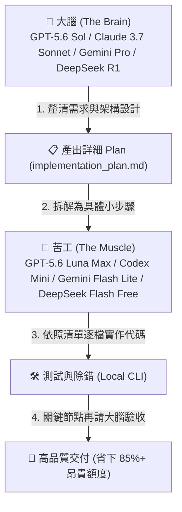

# 🧘‍♂️ 客家 Vibe Coding 終極指南：免費工具與算力極限省額度心法

> **「Vibe Coding」的核心是：你負責定義意圖與架構（The Vibe），AI 負責搬磚實作（The Code）。**  
> 但如果不懂得調配模型與管理上下文，你的免費額度或 Token 額度幾分鐘就會被榨乾。本指南教你如何用「客家心法」將免費額度發揮到 300% 的效率！

---

## 🌟 2026 免費與平價 Vibe Coding 工具推薦

| 工具 | 類型 | 核心優勢 | 免費/平價策略 |
| :--- | :--- | :--- | :--- |
| **Google Antigravity (AGY)** | 頂級 Agentic IDE / CLI | Google DeepMind 打造，內建 Planning 模式、Subagents 協同、Artifacts 成果畫布與完整終端工具鏈 | 支援直接串接 Gemini 3.7 / 2.5 免費層或自訂 OpenAI 端點 |
| **Roo Code (前 Roo Cline) / Cline** | VS Code 擴充套件 | 100% 開源自由，完全自主掌控 Provider，支援自訂 MCP 工具與模式切換（Code/Architect/Ask） | 直接對接本機 HakkaAICODE 代理 (`127.0.0.1:15722`) 或 OpenRouter 免費模型 |
| **Cursor** | AI 原生 IDE | 領先的 Tab 補全、Composer 多檔聯動編輯與程式碼索引 | 免費提供 Hobby Tier，可搭配自訂 API Key |
| **Windsurf (by Codeium)** | AI 原生 IDE | Cascade 流程感知對話與深度代碼庫理解 | 免費版提供極充裕的智慧代碼補全與對話配額 |
| **Claude Code / Codex** | 終端機 Agent CLI | 輕量極簡、深度整合 Shell 與 Git，自動執行測試與重構 | 搭配 HakkaAICODE 一鍵提示詞與多 Key 代理無痛起飛 |
| **Continue.dev / Void Editor** | 開源 VS Code 插件 / IDE | 隱私優先、完全開源，支援無縫切換本機 Ollama 或雲端端點 | 零綁定，隨插即用 |
| **v0 / Bolt.new / Lovable** | Web 快速原型 | 自然語言一鍵生成全端 Web 應用與 UI 元件 | 免費提供每日生成額度，適合快速驗證靈感與前端佈局 |

---

## 🧠 客家省額度心法：算力利用率最大化技巧

### 1. 「大腦規劃，苦工打底」模型階梯戰術 (Tiered Brain & Muscle)

不要從頭到尾都用最貴或最高配額的模型寫每一行簡單的程式碼！

- **第一階段（大腦規劃 - Brain）**：
  - 使用高智商模型（如 `GPT-5.6 Sol`、`Claude 3.7 Sonnet`、`Gemini 3.1 Pro`、`DeepSeek R1`）。
  - **任務**：需求梳理、架構選型、邊界條件分析、產出步驟清晰的 `implementation_plan.md`。
  - **原則**：只出規劃與虛擬碼，**不要讓它直接噴出幾千行實現代碼**。
- **第二階段（苦工實作 - Muscle）**：
  - 切換為速度快、配額高或完全免費的模型（如 `GPT-5.6 Luna Max`、`Codex Mini`、`Gemini 2.5 Flash Lite`、`deepseek-v4-flash-free`、`mimo-v2.5-free`）。
  - **任務**：拿著大腦寫好的 Plan，一步一步建立檔案、填寫函式、套用樣式。
- **第三階段（大腦審查 - Critic）**：
  - 遇到複雜 Bug 或全部功能完成時，再切回大腦模型進行整體驗收與 Code Review。

---

### 2. 「Context 瘦身術」避免 Token 滾雪球

AI Coding 工具在對話時，每一輪都會把「所有對話紀錄 + 打開的檔案」重複送出。對話到了第 10 輪，每次發問可能都在浪費 30,000 ~ 80,000 tokens！

- 🧹 **任務完成立刻 Reset**：每搞定一個獨立功能或修好一個 Bug，立刻 `/clear` 或開新對話（New Session），讓 AI 在最輕量、最清醒的狀態開始下一項任務。
- 🚫 **嚴格設定忽略檔案**：在專案根目錄配置 `.gitignore`、`.cursorrules` 或 `.aiconfig`，確保以下檔案絕對不進入 AI Context：
  - `node_modules/`, `dist/`, `build/`, `.next/`, `target/`
  - `package-lock.json`, `pnpm-lock.yaml`, `yarn.lock`
  - 巨大的日誌檔（`*.log`）與二進位媒體檔。

---

### 3. 「增量 Diff 補丁」取代全檔重寫

全檔重寫是 Token 殺手。若修改一個 500 行的檔案中 3 行代碼，讓 AI 全檔重寫會浪費 500 output tokens，且容易遺漏原有的邏輯。

- **正確姿勢**：在 System Prompt 或對話中要求 AI：
  > *「請僅輸出修改區塊的 Search/Replace Block 或 Unified Diff，不要重覆輸出未修改的完整檔案。」*
- 這不僅大幅減少消耗的 Output Token，生成速度還快 5~10 倍！

---

### 4. 「多 Key 輪換 + 三級備援池」

透過本專案的 `scripts/server-multikey.js`，你可以建立永不中斷的免費算力防線：

1. **第一防線（OpenCode Zen 多 Key 輪換池）**：
   - 準備 2~5 把免費 Zen Key 填入 `zen-keys.txt`。
   - 遭遇單一 Key 的 429 限流時，代理伺服器自動平滑切換下一把並進入階梯冷卻。
2. **第二防線（OpenRouter :free 社群池）**：
   - 備妥 `deepseek/deepseek-chat:free` 或 `meta-llama/llama-3.3-70b-instruct:free`。
3. **第三防線（Google AI Studio 官方 Free Tier）**：
   - 個人開發者每日 1500 請求額度，擁有 1M 超大上下文視窗，專治大專案重構。

---

### 5. 「本地 CLI 腳手架先行」

不要讓 AI 在對話裡逐行幫你生成 `create-react-app` 或 `vite` 的 20 個空配置檔！

- **正確做法**：
  1. 自己在終端機執行 `npm create vite@latest my-app -- --template react-ts`。
  2. 安裝好依賴並確認能跑起來。
  3. 再把專案交給 AI：「請在現有的 Vite + React 專案中新增購物車狀態與結帳頁面」。
- 既快又穩，節省數千 Tokens 與寶貴的配額！
